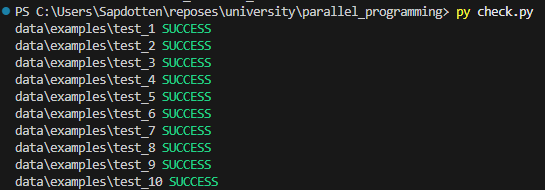
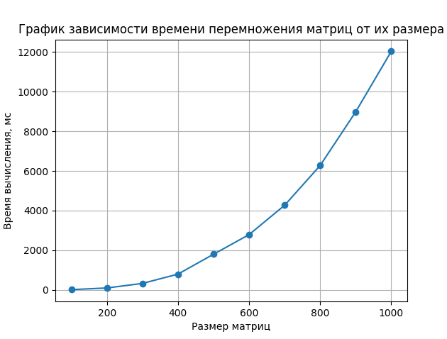

# Отчет по лабоартораной работе №1
*Выполнил: студент гр.6311-100503D Семенова Александра*
## Ход работы

В рамках лабораторной работы был реализован класс на C++ для умножения матриц заданного размера с использованием метода прямого перебора элементов. Исходный код располагается в файле `src/main.cpp`, где осуществляются следующие шаги:

1. Генерация квадратных случайных матриц A и B с размерами от 100 до 1000 с шагом 100.
2. Замер среднего времени, используемого для вычисления произведения матриц C = A * B, при этом среднее время вычисляется на основе 10 тестов для каждой размерности.
3. Сохранение матриц A, B и C в папку `data/examples/test_i`, где `i` обозначает номер теста.
4. Запись информации о размерах матриц и соответствующем времени выполнения в файл `data/time_result.csv`.

Также был написан скрипт на Python `check.py`, который выгружает все матрицы из папки `data/examples` и проверяет правильность результатов вычислений с помощью `numpy`.

Скрипт `graphics.py` создает график зависимости времени выполнения от размера матриц.

## Результаты
Написанный алгоритм правильно вычисляет матричное произведение, что подтверждается проверкой `check.py`:

По графику можно сделать вывод о том, что из-за неоптимизированного метода вычисления произведения матриц, время выполнения операции стремительно увеличивается с ростом размера матриц.

---
## Задание

Написать программу на языке C/C++ для перемножения двух матриц. 
Исходные данные: файл(ы) содержащие значения исходных матриц.
Выходные данные: файл со значениями результирующей матрицы, время выполнения, объем задачи.
Обязательна автоматизированная верификация результатов вычислений с помощью сторонних библиотек или стороннего ПО (например на Matlab/Python).

